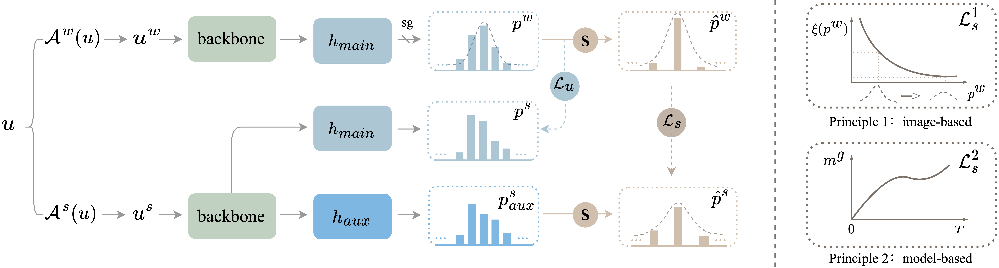

# ShrinkMatch

[[`Paper`]()] [[`Logs`](./training-logs)] [[`BibTeX`](#Citation)]

This codebase provides the official PyTorch implementation of our ICCV 2023 paper:

> **[Shrinking Class Space for Enhanced Certainty in Semi-Supervised Learning]()**</br>
> Lihe Yang, Zhen Zhao, Lei Qi, Yu Qiao, Yinghuan Shi, Hengshuang Zhao</br>
> *In International Conference on Computer Vision (ICCV), 2023*</br>

<p align="left">

</p>


## Summary

In semi-supervised learning, to mitigate potentially incorrect pseudo labels, recent frameworks mostly set a fixed confidence threshold to discard uncertain samples. This practice ensures high-quality pseudo labels, but incurs a relatively low utilization of the whole unlabeled set.

Our **key insight** is that these uncertain samples can be turned into certain ones, as long as the confusion classes for the top-1 class are detected and removed. For each uncertain sample, our proposed ShrinkMatch adaptively seeks a shrunk class space, which merely contains the original top-1 class as well as remaining less likely classes, to satisfy the pre-defined threshold, *e.g.*, 0.95. We then impose a consistency regularization in this shrunk space. Furthermore, considering the varied reliability among uncertain samples and the gradually improved model during training, we correspondingly design two reweighting principles for our uncertain loss.


## Results

**We provide [all training logs](./training-logs). You can refer to them when reproducing.**

### CIFAR-10 @40 labels

|       Seed      |   0   |   1   |   2   |   3   |   4   |    Mean   |
|:---------------:|:-----:|:-----:|:-----:|:-----:|:-----:|:---------:|
|    SimMatch     | 95.34 | 95.16 | 92.63 | 93.76 | 95.10 |   94.39   |
| **ShrinkMatch** | 95.09 | 94.66 | 95.12 | 94.78 | 94.95 | **94.92** |


### CIFAR-100 @400 labels

|       Seed      |   0   |   1   |   2   |   3   |   4   |    Mean   |
|:---------------:|:-----:|:-----:|:-----:|:-----:|:-----:|:---------:|
|    SimMatch     | 62.06 | 60.19 | 59.89 | 64.88 | 63.92 |   62.19   |
| **ShrinkMatch** | 65.00 | 63.47 | 63.77 | 66.42 | 64.52 | **64.64** |


### STL-10 @40 labels

|       Seed      |   0   |   1   |   2   |    Mean   |
|:---------------:|:-----:|:-----:|:-----:|:---------:|
|    FlexMatch    | 76.71 | 68.28 | 67.55 |   70.85   |
| **ShrinkMatch** | 85.75 | 85.64 | 86.55 | **85.98** |


### SVHN @40 labels

|       Seed      |   0   |   1   |   2   |    Mean   |
|:---------------:|:-----:|:-----:|:-----:|:---------:|
|    FlexMatch    | 89.19 | 89.93 | 96.32 |   91.81   |
|    FixMatch     | 94.53 | 96.90 | 97.14 |   96.19   |
| **ShrinkMatch** | 97.96 | 97.81 | 96.70 | **97.49** |


### ImageNet-1K

|     Accuracy    | Top-1 @1% labels | Top-1 @10% labels | Top-5 @1% labels | Top-5 @10% labels |
|:---------------:|:----------------:|:----------------:|:----------------:|:----------------:|
|    SimMatch*    |        67.0      |       74.1       |       86.9       |       91.5       |
| **ShrinkMatch** |      **67.5**    |     **74.5**     |     **87.4**     |     **91.9**     |

*Reproduced in our environment

## Usage

Please enter the corresponding directory according to your dataset.


## Acknowledgment

Many thanks to [SimMatch](https://github.com/mingkai-zheng/simmatch), [TorchSSL](https://github.com/TorchSSL/TorchSSL), and [FixMatch-PyTorch](https://github.com/kekmodel/FixMatch-pytorch) for sharing their codebases and training logs.


## Citation

If you find this project useful, please consider citing:

```bibtex
@inproceedings{shrinkmatch,
  title={Shrinking Class Space for Enhanced Certainty in Semi-Supervised Learning},
  author={Yang, Lihe and Zhao, Zhen and Qi, Lei and Qiao, Yu and Shi, Yinghuan and Zhao, Hengshuang},
  booktitle={ICCV},
  year={2023}
}
```